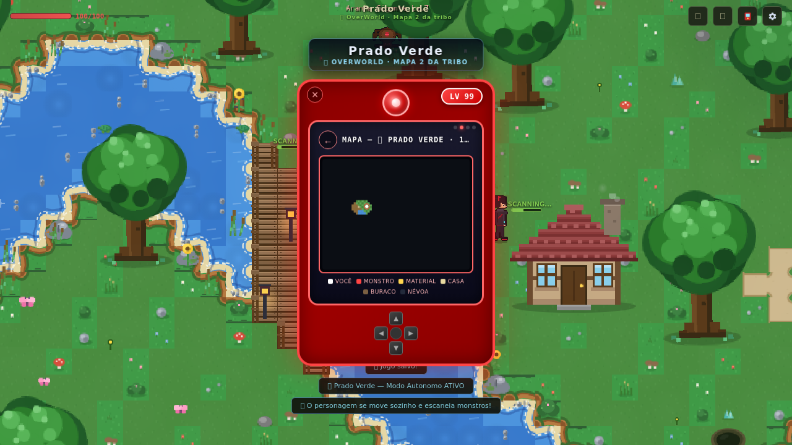
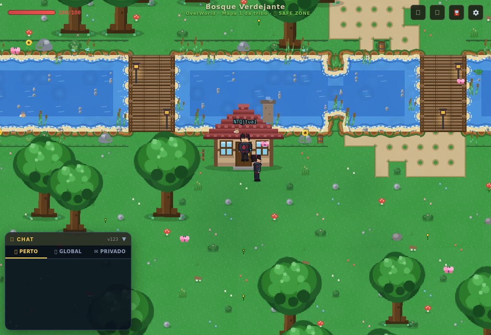
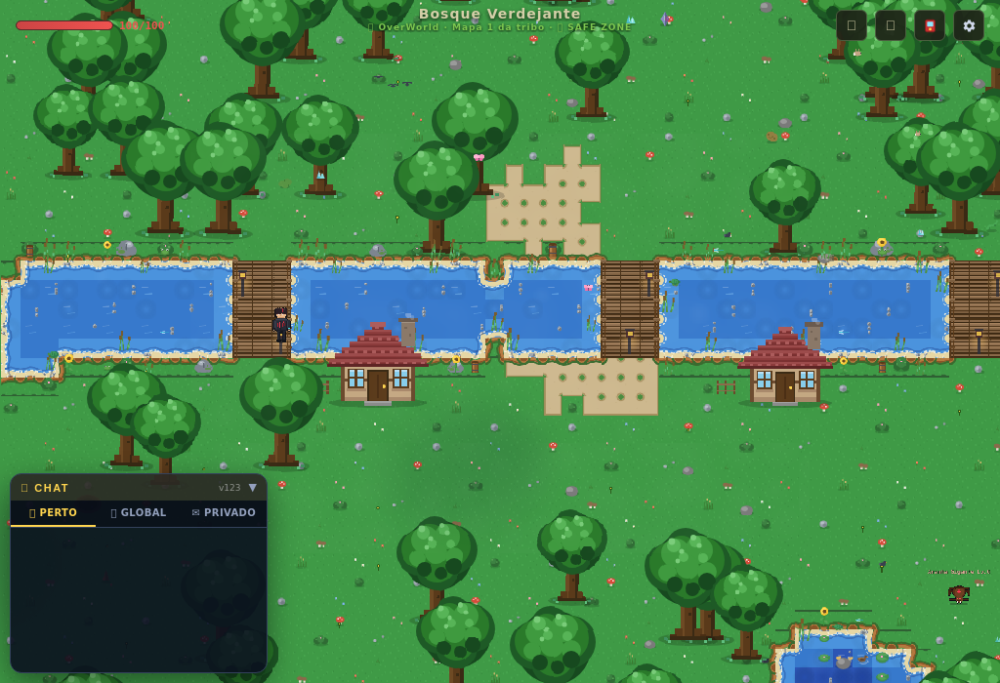
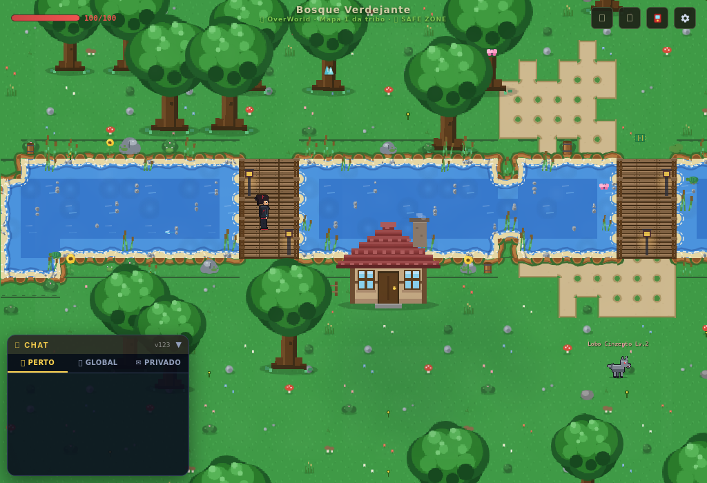
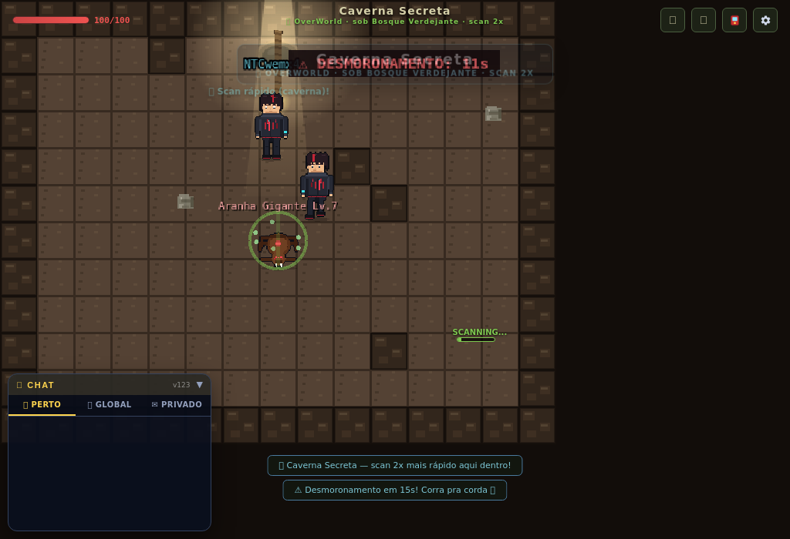
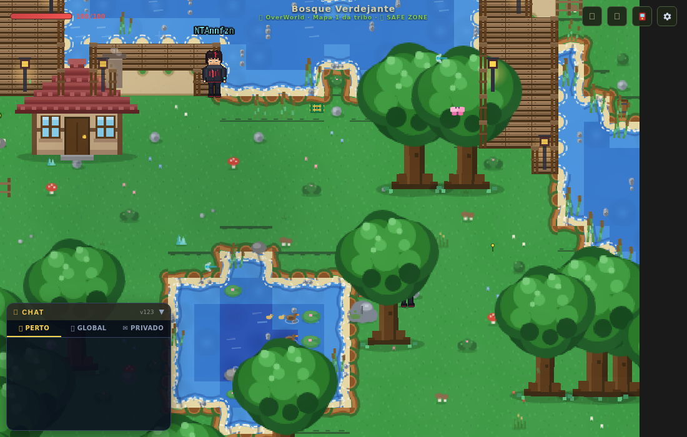
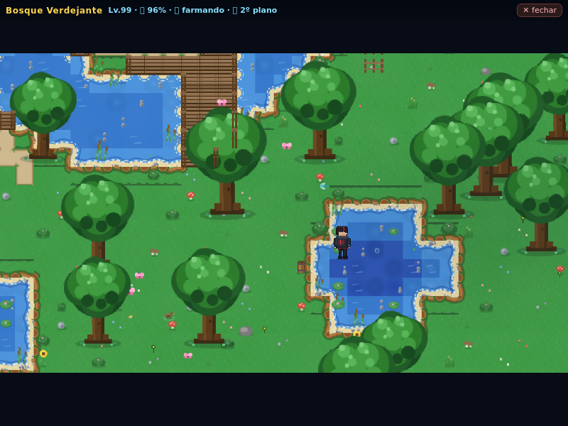
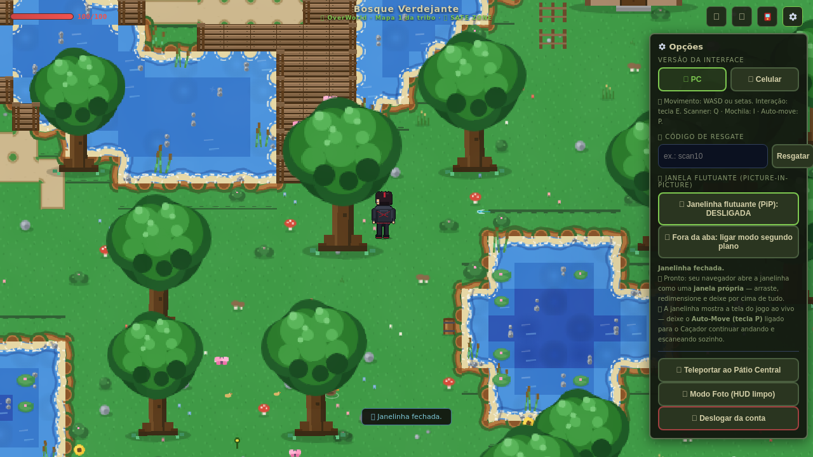

# 🎮 Chaotic.IdleWorld — Online

MMO **idle** ambientado no universo de **Chaotic**: você é um portador de Scanner que explora os
mapas de **Perim**, escaneia criaturas (que viram **Scan Cards** colecionáveis), forja equipamentos,
duela contra os **7 Mestres do Código** e outros jogadores no **Dromo** — tudo direto no navegador,
com contas reais, chat, PVP e save na nuvem.



**Rodando com Node puro (zero dependências).** Contas com senha (scrypt), sessão por cookie HttpOnly,
captcha anti-bot, chat global/privado, PVP online em tempo real e progresso salvo por conta.

---

## ✨ O que tem no jogo

| | |
|---|---|
| 🗺️ **Mapas por tribo** | 12 regiões (OverWorld, UnderWorld, Danian, Mipedian, M'arrillian) + Pátio Central, Ilha dos Dromos, Caverna Secreta e a arena do Dromo |
| 📡 **Scanner** | mais de 30 criaturas, Scan Cards com raridade, IVs e código único |
| 🤖 **Idle de verdade** | Auto-Move (tecla **P**) farma sozinho: anda, escaneia e coleta materiais |
| 🌫️ **Fog of war** | o mapa vai sendo revelado conforme você explora (salvo por região, com minimapa ao vivo) |
| ⚔️ **Dromo** | batalha em tempo real (3 Scans + Battlegear/Mugic + 3 mapas, roleta e moeda cara/coroa) |
| 🧑‍🤝‍🧑 **Online** | chat global/privado, presença no mapa, PVP pareado pelo servidor |
| 👑 **Progressão** | 5ª tribo (M'arrillian) no Lv.40, 100% de escaneamento libera o chefe de cada mapa |
| 📺 **Janelinha (PiP)** | o jogo numa janela flutuante sempre na frente + modo "fora da aba" (o Caçador continua farmando com a aba escondida) |
| 🗺️ **Mapas de verdade** | cada região é uma sala própria (online, chat PERTO e relevo separados) com criaturas exclusivas |

---

## ▶ Como rodar na sua máquina

```bash
node server/server.js
# → http://localhost:8901
```

Só precisa de **Node.js 18+**. O site fica em `/`, o jogo em `/game` (exige login).

---

## ☁️ Publicar de graça (Render.com)

1. Suba este repositório no GitHub;
2. **render.com → New + → Web Service → Connect** o repositório;
3. Confira: **Runtime** Node · **Build Command** *(em branco)* · **Start Command** `npm start` · **Instance** Free;
4. **Create Web Service** e aguarde o deploy (~2 min).

> ⚠️ O plano free perde o `server/data/db.json` a cada deploy/restart. Para o progresso sobreviver,
> configure **Supabase** (`SUPABASE_URL` + `SUPABASE_KEY`) — passo a passo em
> [`docs/SUPABASE.md`](docs/SUPABASE.md).

Antes de abrir para o público, troque as chaves **Turnstile** de teste pelas suas (no topo de
`server/server.js`): as atuais são as chaves oficiais de teste da Cloudflare e sempre deixam passar.

---

## 📁 Estrutura

```
chaotic-online/
├── package.json                  ← como o servidor inicia (npm start)
├── chaotic_idleworld_v123.html   ← O JOGO (v2.30 — carta de scan nova e qualidade em 50 pontos com
│                                    pesos; + o banco de 120 como fonte de criaturas do jogo inteiro
│                                    (v2.29), a batalha pela ficha (v2.28), a Coleção das 120; + v2.27
│                                    a v2.23 e tudo o que já existia)
├── server/
│   ├── server.js                 ← servidor completo (Node puro)
│   ├── fem.json · skins.json     ← assets das skins
│   └── README.md                 ← documentação técnica detalhada
├── site/
│   └── index.html                ← site: ▶ JOGAR abre o jogo em página própria (sem iframe)
│                                    + botão 🪟 JANELA PRÓPRIA por personagem
├── creatures/                    ← SISTEMA DE CRIATURAS: 120 cartas + SpawnManager + cartas.html
│                                    (v2.27–v2.29 — as 120 estão INTEGRADAS no jogo inteiro)
│   ├── README.md                 ← como o banco foi montado (modelo, fórmulas, lore, mapa de spawn)
│   ├── cartas.html               ← visualizador das 120 cartas (arquivo único, abre no navegador)
│   ├── src/ · data/ · tools/ · test/
└── docs/
    ├── PASSO-A-PASSO.md          ← guia de hospedagem para leigos
    ├── SUPABASE.md               ← save na nuvem que sobrevive a redeploy
    ├── MAPAS-E-SCAN.md           ← mapas + scan + rio/pontes/Caverna + quadrados escuros + Safe Zone + Opções/auto-move/itens/MASTER + o banco de 120 (v2.27) + batalha e Coleção das 120 (v2.28) + o banco no jogo inteiro (v2.29) + a carta nova e a qualidade em 50 pontos (v2.30) + Terra = ⛰️ (v2.31)
    ├── CORRECAO-NOMES-DE-MAPA.md ← o que mudou no HUD dos mapas (v2.18)
    ├── JANELINHA-PIP.md          ← janelinha flutuante + fora da aba + correção do iframe (v2.20)
    ├── patches/                  ← scripts que aplicam cada mudança (histórico reproduzível)
    └── img/                      ← prints usados nestes documentos
```

---

## 🧬 Sistema de Criaturas (novo)

Banco de **120 criaturas** (4 tribos × 30, distribuídas em 5 + 10 + 15 pelos 3 primeiros mapas de cada tribo),
com modelo de carta (Coragem/Poder/Sabedoria/Velocidade), **contadores de mugic** inversamente proporcionais
à força, afinidade elemental de lore e o **SpawnManager** que define o que nasce em cada mapa
(mapa 1: 5 passivas · mapa 2: 6 passivas + 4 agressivas com 1 rara · mapa 3: 7 passivas + 8 agressivas com 2 raras —
rara = **+20%** de velocidade e dano). Entrega validada por **146 verificações automáticas**.

👉 Detalhes em [`creatures/README.md`](creatures/README.md) · cartas em [`creatures/cartas.html`](creatures/cartas.html)
👉 **Desde a v2.27 o banco está dentro do jogo** (cada mapa nasce com as criaturas da sua tribo/nível) e
👉 **desde a v2.28 ele vale também na arena** (o elemento decide o arquétipo) — com a **Coleção das 120** no Scanner.
👉 **desde a v2.29 ele é a fonte de TODA criatura do jogo** (Roleta, Leilão, Drome, duelos, Mestres) e aparece no Portal de Viagem.
👉 **na v2.30 a carta de scan ficou no formato novo** e a qualidade passou a **0–50 com pesos** (60/25/10/4,9/0,1).
(abra o arquivo no navegador).

---

## 🆕 Novidades

**v2.31 — O elemento TERRA virou montanha ⛰️**
O ícone do elemento **Terra** deixou de ser o planeta **🌍** (que confundia na carta) e passou a ser
**⛰️ montanha** — nos círculos da carta de scan, no painel do Scanner, na Coleção das 120 e nas cartas
clássicas; **cartas antigas** salvas com o 🌍 são convertidas ao abrir. Fogo 🔥, Água 💧 e Ar 🌪️ seguem
iguais, e o círculo do meio continua sendo a **tribo** (🌲 OverWorld · 🌋 UnderWorld · 🐝 Danian ·
🏜️ Mipedian · 🌊 M'arrillian). Testes: **13 ✅** novos + **26 ✅ · 16 ✅ · 17 ✅ · 2 ✅ · 24 ✅ · 3 ✅ ·
22 ✅ · 7 ✅ · 146 OK** de regressão, com **0 erros de página**.
→ [`docs/MAPAS-E-SCAN.md`](docs/MAPAS-E-SCAN.md) seção 14 ·
[`docs/img/carta-terra-montanha-v231.png`](docs/img/carta-terra-montanha-v231.png)

**v2.30 — Carta de scan nova + qualidade em 50 pontos (com pesos)**
A carta que aparece na **captura** e no **acervo do Scanner** foi refeita no formato pedido: só **Nome** e
**Raridade** no topo, a arte com o **Lv.**, as **4 caixas de status** (❤️ vida · ⚔️ poder · 🎯 Estratégia ·
🛡️ Vitalidade), os **4 círculos centrais** com os **elementos** (1 ou 2) em volta do **símbolo da tribo**,
a **caixinha de Mugic**, o **QUALIDADE DO SCAN: X%** com a barrinha, o **STATUS** e o **CÓDIGO** na base.
Saíram os textos soltos ("OverWorld · Mapa 2 · Passiva", "Água · Mugic: 2") e a habilidade. E a
**qualidade mudou de escala**: cada atributo vai de **0 a 50** (antes 31) e o sorteio virou **Weighted
Random** — **FRACO/Comum 60%** (média 0–12) · **MÉDIO/Incomum 25%** (13–22) · **BOM/Raro 10%** (23–35) ·
**EXCELENTE/Épico 4,9%** (36–45) · **PERFEITO/Lendário 0,1%** (46–50). Medido em 120.000 scans:
59,83% / 25,15% / 9,98% / 4,95% / 0,09%. Roleta e Leilão usam a mesma escala. Testes: **26 ✅** novos +
**16 ✅ · 17 ✅ · 2 ✅ · 24 ✅ · 3 ✅ · 22 ✅ · 7 ✅ · 146 OK** de regressão, com **0 erros de página**.
→ [`docs/MAPAS-E-SCAN.md`](docs/MAPAS-E-SCAN.md) seção 13 ·
[`docs/img/carta-scan-v230.png`](docs/img/carta-scan-v230.png) ·
[`docs/img/carta-rara-v230.png`](docs/img/carta-rara-v230.png) ·
[`docs/img/carta-scanner-v230.png`](docs/img/carta-scanner-v230.png)

**v2.29 — O banco de 120 no jogo INTEIRO (Roleta, Leilão, Drome, Mestres)**
Agora **toda criatura que aparece no jogo vem do banco**: a lista **"Monstros na Roleta"** mostra só as
120 (com *Tribo · M1/M2/M3* e ★ na rara), o **Leilão** vende scans e aceita pedidos só das 120, o
**MASTER (+1 Scan)**, os **duelos aleatórios do Dromo**, as **ondas da Drome** e os **códigos
promocionais** sorteiam só elas — e os **7 Mestres do Código** ganharam **decks do banco** por tribo
(o Chirrul fecha com a **rara Lagartixa Férrea** na equipe). O **Portal de Viagem** ganhou a faixa
**"🧬 Banco de 120 criaturas — X/120 escaneadas · abrir a Coleção 📖"**, que abre o painel da Coleção
com um clique. A **Lagoa Negra M'arrillian** continua com o pool clássico (o banco não tem
M'arrillians) e **as cartas que você já tinha continuam no inventário**. Testes: **17 ✅** e **2 ✅**
novos + **16 ✅ · 24 ✅ · 3 ✅ · 22 ✅ · 7 ✅ · 146 OK** de regressão, com **0 erros de página**.
→ [`docs/MAPAS-E-SCAN.md`](docs/MAPAS-E-SCAN.md) seção 12 ·
[`docs/img/portal-banco-v229.png`](docs/img/portal-banco-v229.png) ·
[`docs/img/roleta-120-v229.png`](docs/img/roleta-120-v229.png) ·
[`docs/img/leilao-banco-v229.png`](docs/img/leilao-banco-v229.png) ·
[`docs/img/drome-banco-v229.png`](docs/img/drome-banco-v229.png)

**v2.28 — O banco de 120 entrou na BATALHA + a COLEÇÃO das 120 dentro do jogo**
O banco fechou o ciclo: agora ele vale também **na arena**. Na **batalha** (Dromo contra os 7 Mestres do
Código e **PVP**), o **elemento** da espécie escolhe o arquétipo de luta — 🔥 **Fogo → Pyrodonte** ·
💧 **Água → Aquarion** (rara → **Noctumbra**) · 🌍 **Terra → Terramole** (mística → **Sibilora**) ·
🌪️ **Ar → Voltrax** — e **vida, dano e velocidade saem da própria ficha** em vez de serem sorteados:
`vida = 0,85 + (HP − 30)/220` · `dano = 0,85 + (ATK − 5)/100` · `velocidade = 0,90 + (vel − 124)/400`
(calibrado nas faixas reais do banco: HP 30–152 · ATK 5–49 · vel 124–225). Assim o **Falcão Carbonizado
[Fogo]** entra na arena como Pyrodonte com **HP 379** (base 330) e **fís 38** (base 34), e a descrição
mostra **"Habilidade de carta (banco): …"** junto de tribo, raridade e Mugic — o **Scan clássico**
(inclusive M'arrillians) continua pelo caminho antigo. E nasceu a **COLEÇÃO das 120 dentro do jogo**: um
botão no **acervo do Scanner** abre o painel com **Todas + as 4 tribos** (30 cada), progresso **x/30** e
**x/120**, filtro **Todas · Escaneadas · Faltando** e, por espécie, **arte · nível · elementos · passiva
ou agressiva · Mugic · em qual mapa do jogo ela vive · habilidade · ✓** (a ✓ usa o seu scan real).
Testes: **16 ✅** na batalha + **24 ✅**, **22 ✅**, **7 ✅** e **3 ✅** de regressão + **146 OK** no banco,
com **0 erros de página**.
→ [`docs/MAPAS-E-SCAN.md`](docs/MAPAS-E-SCAN.md) seção 11
[`docs/img/colecao-120-v228.png`](docs/img/colecao-120-v228.png) ·
[`docs/img/batalha-banco-v228.png`](docs/img/batalha-banco-v228.png)

**v2.27 — O banco de 120 criaturas está DENTRO do jogo**
As **120 criaturas** do banco (4 tribos × 30) viraram o conteúdo de Perim: cada mapa nasce só com as
criaturas da **sua tribo** e do **seu nível** — **m1 com 5 · m2 com 10 · m3 com 15** (o m3 tem 2 raras e
8 agressivas). Cada criatura traz a ficha do banco: HP, ATK, **velocidade própria**, XP, Bits, arte,
**elementos**, **habilidade**, **contadores de Mugic**, raridade e agressividade. Entrou também a região
que faltava para o banco caber inteiro: **Miragens do Palmeiral** (Mapa 3 dos Mipedians, Lv.20 + 100% das
Ruinas do Tempo) com as 15 criaturas mipedianas do mapa 3. O spawn é **ponderado** (passiva 34 ·
agressiva 26 · **rara 12** — medido: 6,1% de raras), a rara aparece com **★** no rótulo e a passiva com
☮️, e a **velocidade vem da espécie** (com teto de 175 px/s para o herói ainda alcançar; a rara +20%
continua). Nas **cartas** (scan, roleta e Scanner) entram **Tribo · Mapa**, os **elementos do banco**,
a **habilidade** e o **Mugic**, e a raridade da espécie vira o **piso** da carta — Rara nunca sai como
Comum. O banner do mapa e o Portal mostram **🐾 N espécies**, e o `%` de scan do mapa é sobre as espécies
do banco. A **Lagoa Negra M’arrillian** segue com o pool clássico (o banco não tem M’arrillians).
Testes: **24 ✅** no banco integrado + **22 ✅** e **7 ✅** nas regressões da v2.26, e a caça medida no
mesmo instrumento (150s no Bosque) segue na mesma faixa da versão anterior.
→ [`docs/MAPAS-E-SCAN.md`](docs/MAPAS-E-SCAN.md) seção 10 ·
[`docs/img/banco-120-mapa-v227.png`](docs/img/banco-120-mapa-v227.png) ·
[`docs/img/banco-120-carta-v227.png`](docs/img/banco-120-carta-v227.png) ·
[`docs/img/banco-120-portal-v227.png`](docs/img/banco-120-portal-v227.png) ·
[`docs/img/banco-120-scanner-v227.png`](docs/img/banco-120-scanner-v227.png)

**v2.26 — Opções limpas, Auto-Move automático, itens raros e o MASTER da Ilha dos Dromos**
Quatro pedidos seus, quatro entregas. **(1) Auto-Move automático:** a tecla **P saiu do jogo** (e o
botão 🤖/⏸ do celular virou só 👆 de interação) — *"a pessoa não pode controlar quando pode estar em
auto move, essa função é exclusiva para mapas de criaturas"*. Agora quem decide é o mapa: **ligado**
nos 5 mapas de criaturas (Bosque Verdejante, Cavernas de Brasas, Túneis do Monte Pillar, Oásis
Enfumaçado, Lagoa Negra) e na **Caverna Secreta**; **desligado** no Pátio Central, na **Ilha dos
Dromos** e no **Dromo (arena)** — lá o controle é 100% seu. **(2) Painel de Opções limpo:** saíram os
textos explicativos, cada opção ficou **só com o ícone e o nome** (10 botões, de PC/Celular a Deslogar);
erro da janelinha continua avisando, mas como aviso rápido na tela. **(3) Itens a 10%:** item agora é
item — nasce **2 por mapa** com **teto 6** (antes 20 e 60) e **1 na Caverna Secreta** (antes 3). É isso
que dá **mercado no Leilão**. **(4) NPC MASTER na Ilha dos Dromos:** um NPC dourado com **[E] Falar com
o MASTER** (funciona no toque e no clique) e **um botão para cada coisa** — **+1 LV**, **+1000 Bits**,
**+1 Scan aleatório** (creditado na região certa da espécie), **+1 Equipamento de batalha** e
**+1 Mugic** (respeitando o limite de 100 cartas). Testes: **22 ✅** no painel/auto-move/MASTER +
**7 ✅** nos itens e nas regressões do v2.25 (aranha agressiva em SAFE ZONE escaneada, Caverna em
1517ms). → [`docs/MAPAS-E-SCAN.md`](docs/MAPAS-E-SCAN.md) seção 9 ·
[`docs/img/opcoes-limpo-v226.png`](docs/img/opcoes-limpo-v226.png) ·
[`docs/img/npc-master-v226.png`](docs/img/npc-master-v226.png) ·
[`docs/img/itens-raros-v226.png`](docs/img/itens-raros-v226.png)

**v2.25 — o herói vai atrás e escaneia QUALQUER criatura (inclusive em SAFE ZONE)**
**"Passei pela aranha quase do lado e meu personagem passou reto, não foi atrás dela e nem escaneou ela."**
A Safe Zone (mapa 1 de cada tribo) zera o raio de ameaça — correto, lá nada te persegue — mas o
auto-move usava esse **mesmo zero** para **descartar os agressivos da caça**: nos 4 mapas 1 uma
Aranha Gigante era invisível para o herói (ele chegava a **58px** dela sem fazer nada). Agora o zero
desliga **só a fuga/stalk**: criatura a **≤160px → o herói vai atrás**; a **≤96px → ele PARA e
escaneia (3s)**. E se a criatura **encostar** (≤32px ela cancela o scan a cada 1,2s), o herói **recua
andando sem largar o scan** — sem isso a carga reiniciava para sempre e o bicho nunca era escaneado.
Fuga/stalk nos mapas perigosos, carga de 3s, alvo de 96px, detecção de 160px, RARA a 50% de
velocidade e a Caverna 2x seguem **iguais**. De quebra, uma **blindagem**: quatro pontos faziam
`corpo.enable = false` sem conferir se o corpo existia — se a criatura fosse destruída no meio de um
scan, o erro acontecia **dentro do update da cena** (congelamento num jogo idle). Agora o scan
cancela e o herói volta a andar. E um **segundo caminho do mesmo bug** (v160): a perseguição não
tinha desistência e as criaturas não colidem com casas (o herói colide) — o herói podia ficar empurrando
uma parede para sempre ignorando uma Aranha a 87px. Agora ele larga o alvo inalcançável (preso ~2,4 s
sem sair do lugar, ou alvo além de 300 px) e volta a caçar quem estiver perto. Testes: 19 cenários no
Chrome (8 de regra + caverna + janelinha + 2 naturais com a criatura andando) e jogo livre de 210 s —
tudo verde.
→ [`docs/MAPAS-E-SCAN.md`](docs/MAPAS-E-SCAN.md) seção 8 · comparativo em
[`docs/img/comparativo-aranha-v225.png`](docs/img/comparativo-aranha-v225.png)

**v2.24 — fim dos quadrados escuros no mapa**
**"Meu mapa tá diferente da imagem que você mandou, cheio de quadrados escuros."** A **grama decorada**
(pedra, cogumelo, tufo e flor — **25% dos tiles de grama**) e os **barrancos da margem** também são
desenhados com a paleta da tribo, mas só a **grama lisa** era re-assada ao trocar de mapa. Quem estava
num mapa escuro (Cavernas de Brasas, `#4a3230`) e ia para o Bosque Verdejante via a grama verde coberta
de manchas quase pretas — e as manchas do print eram **exatamente** a paleta das Cavernas de Brasas.
Agora **toda troca de mapa re-assa tudo o que depende do tema** (grama lisa, as 12 texturas de grama
decorada e os barrancos) e a cena do mapa confere o tema antes de assar o chão. Medido no Chrome, no
mesmo enquadramento do print: os pixels da paleta errada caíram de **11,0% para 0,1%** (o resto são tons
do tronco) e os 5 mapas ficaram com grama + 12 decoradas + barranco na paleta certa. Nenhuma regra de
jogo mudou (scan, rio, pontes e caverna iguais).
→ [`docs/MAPAS-E-SCAN.md`](docs/MAPAS-E-SCAN.md) seção 7



**v2.23 — o rio de ponta a ponta + 3 pontes (só no rio) + scan com a criatura colada**
**(1) "Criou pontes mal feitas, quebrou o rio."** A v2.22 também transformava em travessia **toda coluna
onde uma estrada encostava na água** — com dezenas de estradas perto da água isso colava pontes uma na
outra e elas apareciam como **decks largos** (um deles 8×7 tiles) cobrindo o rio; uma dessas colunas
ainda passava por cima de um **lago**. E a **praia de chegada** convertia em estrada a água do rio, o que
**cortava o rio** no meio do mapa. Agora: o rio é marcado tile por tile e um passe final **reimpõe a água**
onde algum terreno tentou tapá-lo (e o próprio rio **desvia** da praia de chegada); a travessia existe
**só nas 3 colunas fixas** (0,22 · 0,52 · 0,80 da largura — esquerda, meio e direita) e **nunca sobre
lago** (faixa com água funda não recebe ponte). Medido nos 5 mapas: **15 pontes, todas de terra a terra,
0 decks, 0 pontes em lago, rio 63/63 colunas sem nenhum corte**.
**(2) Caverna Secreta com a criatura encostada.** Com o bicho a ≤32px o toque cancela o scan a cada 1,2 s,
mas a carga da caverna é de 1,5 s — o scan **nunca fechava** (medido: 25 tentativas, 0 concluídas). Agora
o herói **recua andando sem largar o scan** quando o alvo chega a menos de 44px, fecha a carga e volta a
caçar se a criatura fugir: **4/4 cenários concluídos** nos testes (antes: travava).
→ números completos em [`docs/MAPAS-E-SCAN.md`](docs/MAPAS-E-SCAN.md)



**v2.22 — pontes com começo, meio e fim + scan na Caverna Secreta (dois bugs de jogador)**
**(1) As pontes soltas no lago.** Toda estrada que tivesse água do lado virava ponte — inclusive em terra
firme — e os lagos, desenhados depois, pulavam os tiles de estrada/ponte já existentes, deixando
**pedaços ilhados no meio da água**. Agora as pontes são construídas **por último**, já com toda a água
pronta: para cada coluna de travessia o jogo acha a faixa contínua de água e **só constrói a ponte se
houver terra firme nas duas pontas** (mínimo 3 tiles de água). Sem travessia válida, não existe ponte.
Medido nos 5 mapas: **22 dos 37 "pedaços" da versão antiga eram tábua solta ou ponte sem saída** — na
v2.22 são **17 pontes, 0 problemas**.
**(2) A Caverna Secreta não escaneava a criatura do lado.** A IA da caverna tinha a regra "não caçar
criaturas agressivas", então a **Aranha Gigante era invisível** para o herói (ele ficava parado ao lado
dela). Agora a caverna caça **qualquer** criatura: aproxima-se só até a **beirada do raio de ameaça**,
para e escaneia (recurando se o bicho colar, sem largar o scan) e mantém o **scan 2x** da caverna.
Medido: com a aranha colada, o **primeiro scan sai em 0,2 s** e conclui (antes: **nunca**, 15,4 s parado
ao lado dela sem escanear).
→ detalhes e números em [`docs/MAPAS-E-SCAN.md`](docs/MAPAS-E-SCAN.md#5-v222--pontes-com-começo-meio-e-fim--scan-na-caverna-secreta)





**v2.21b — correção: a janela aberta pelo 🪟 subia vazia (tela cinza)**
O modo "fora da aba" ligado pela janela nova podia dar um passo de mundo **antes** de o Phaser terminar o
boot — isso consumia a fila de cenas e o jogo abria com **zero cenas**, sem nenhum erro visível. Agora o
co-piloto só dá passo com o jogo de pé. Testado nos 4 cenários (iframe/página normal × com/sem `?pip=1`):
**6 cenas em todos**.

**v2.21 — cada mapa é um mapa (e o scan voltou a funcionar)**
Dois bugs sérios relatados por jogadores: **(1)** quem estava no Bosque Verdejante via — e conversava no
chat **PERTO** — com quem estava nas Cavernas de Brasas; **(2)** as criaturas não davam para escanear
(morriam em 20 s, o herói andava contra a borda do mapa e o alvo fugia no meio da barra). Agora:
o online usa o **id da região** como sala (nada de `'perim'` valendo para todos os mapas), o chat PERTO
separa por mapa, o **terreno é semeado pelo mapa** (cada região tem o seu relevo e é sempre igual a si
mesma) e o **Auto-Move voltou a caçar dentro dos limites do mapa** (antes mirava metas do tamanho do
Pórtico e ficava preso na borda).
A regra do scan ficou **como no design**: **3 s de carga**, alvo a até **3 tiles = 96px**, perseguição de
quem passa a até **5 tiles = 160px**, a criatura perde **50% da velocidade** enquanto é escaneada (pode
escapar) e o Caçador **para** para escanear. As criaturas seguem **raras e difíceis** (máx. 2 vivas no
mapa 1, **20 s** de vida): deixar o Caçador farmando por horas para conseguir um Scan bom é o objetivo.
→ detalhes em [`docs/MAPAS-E-SCAN.md`](docs/MAPAS-E-SCAN.md)



**v2.20 — a janelinha funcionando de verdade quando você joga pelo site**
O navegador **proíbe** abrir a janelinha flutuante a partir de uma página que está dentro de outra
(*"Opening a PiP window is only allowed from a top-level browsing context"*) — era isso que fazia a
janelinha falhar em quem entrava pelo site. Corrigido nos dois lados:
**[1] no site**, o **▶ JOGAR** deixa de usar iframe e abre o jogo como **página própria** (e há um
botão **🪟 JANELA PRÓPRIA** para quem quiser o jogo já numa janela separada);
**[2] no jogo**, se ele se encontrar dentro de um iframe (site antigo, preview…) em vez de mostrar
erro ele usa a janelinha de vídeo e oferece na engrenagem **🪟 Abrir o jogo em janela própria** e
**🌙 Fora da aba**. A janela aberta com `?pip=1` já vem "armada": no primeiro clique ela abre a
janelinha e avisa a aba antiga para parar de rodar/salvar (nunca mais dois saves brigando).
→ detalhes em [`docs/JANELINHA-PIP.md`](docs/JANELINHA-PIP.md)

> Publique **o jogo e o `site/index.html`** juntos — se só o jogo for trocado, o site antigo continua
> abrindo o jogo dentro de iframe (aí o jogo cai no plano B: janelinha de vídeo + atalhos).

**v2.19 — janelinha flutuante (PiP) + jogo fora da aba**
Botão **⚙️ Opções → 📺 Janelinha flutuante**: o canvas vai para uma janela que fica **sempre na frente**
(no Chrome/Edge 116+ é janela própria, arrastável) com cabeçalho mostrando mapa, nível, bateria e se o
Auto-Move está farmando. Junto liga o modo **🌙 Fora da aba**, que mantém a simulação viva quando você
troca de aba (o navegador suspende o `requestAnimationFrame` — daí o jogo "parar"): o jogo assume o loop,
um áudio inaudível evita o throttling de timers e, ao voltar, ele avisa quanto tempo você ficou fora.
→ detalhes em [`docs/JANELINHA-PIP.md`](docs/JANELINHA-PIP.md)



**v2.18 — nome do mapa correto no HUD (v151)**
Antes o rótulo do topo mostrava **"Perim"** em todos os mapas (o texto vinha do tipo de cena, não da
região). Agora ele mostra o **nome real do mapa**, com uma linha de **tribo · mapa N · Safe Zone**, banner
de entrada, título do minimapa e aviso de Fast Travel — tudo a partir de uma fonte única (`REGIONS[].name`).
→ detalhes em [`docs/CORRECAO-NOMES-DE-MAPA.md`](docs/CORRECAO-NOMES-DE-MAPA.md)



---

## 🧭 Controles rápidos

| Ação | Tecla / onde |
|---|---|
| Auto-Move (farmar sozinho) | automático — liga sozinho nos mapas de criaturas e na Caverna Secreta; no Pátio, na Ilha e no Dromo quem anda é você |
| Inventário · Scanner · Chat | **I** · **Q** · **TAB** |
| Modo Foto (HUD limpo) | ⚙️ Opções |
| Trocar mapa (Fast Travel) | Portal / Pátio Central |
| Janelinha flutuante | ⚙️ Opções |
| Jogo em janela separada | site → **🪟 JANELA PRÓPRIA** (no card do personagem) |

---

## ⚖️ Aviso

Projeto **de fã**, sem fins comerciais. *Chaotic* e seus personagens são marcas de seus respectivos
donos; este jogo é uma homenagem feita pela comunidade, com arte própria em pixel art.
